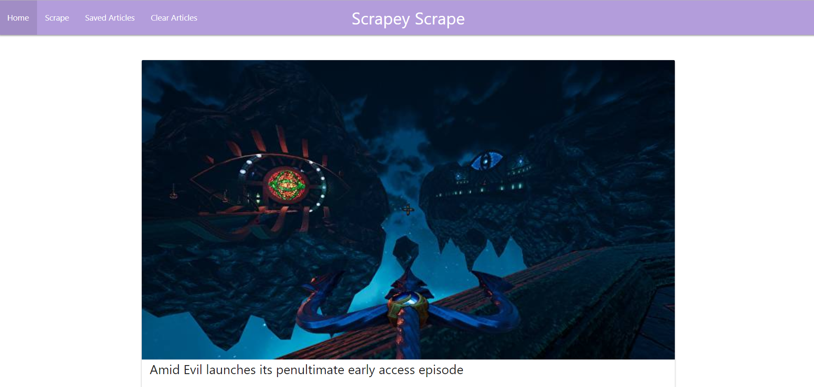

# <a href="https://scrapey-scrape.herokuapp.com/">ScrapeyScrape</a>

Scrapey Scrape is a web app that scrapes <a href="https://www.rockpapershotgun.com/">Rock Paper Shotgun</a>, a gaming news site, for articles and displays them on the main page. Users can then save an article and leave comments on them or discuss the article with other users.

## Instructions
If you would like to pull in the latest articles from Rock Paper Shotgun simply click the "Scrape" button found in the purple nav-bar at the top of the page. If you would like to clear out all the articles from the main page simply click the "Clear Articles" button in the nav-bar. Each article will have two buttons on it. One "Link to Article" which will take you to the original article hosted on Rock Paper Shotgun and another "Save Article" which will send the article to the Saved Articles page. 

To view your saved articles simply click on the "Saved Articles" button found in the nav-bar. To leave a comment on one of your saved articles click on the "View Comments" button found on each article. This will bring up a window with a form on it that you can use to submit your comment which will then be displayed below. To delete a comment just click on the "delete-comment" button found on your comment.

## Technology Utilized
<ul>
  <li><a href="https://www.mongodb.com/">MongoDB</a></li>
  <li><a href="https://materializecss.com/">Materialize CSS</a></li>
  <li><a href="https://cheerio.js.org/">Cheerios</a></li>
  <li><a href="https://mongoosejs.com/">Mongoose</a></li>
  <li><a href="https://expressjs.com/">Express</a></li>
  <li><a href="https://handlebarsjs.com/">Handlebars</a></li>  
</ul>
